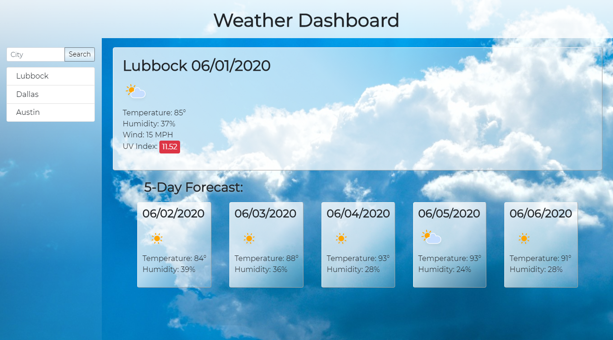

# Weather Dashboard
### HW 6 Server-Side APIs: Weather Dashboard
User inputs a city and receives current weather and a 5 day forecast matching the city submitted. The last city searched is saved in local storage if user returns.
## Tech Stack:
- Javascript
- jQuery
- HTML & CSS
## Screenshots:

